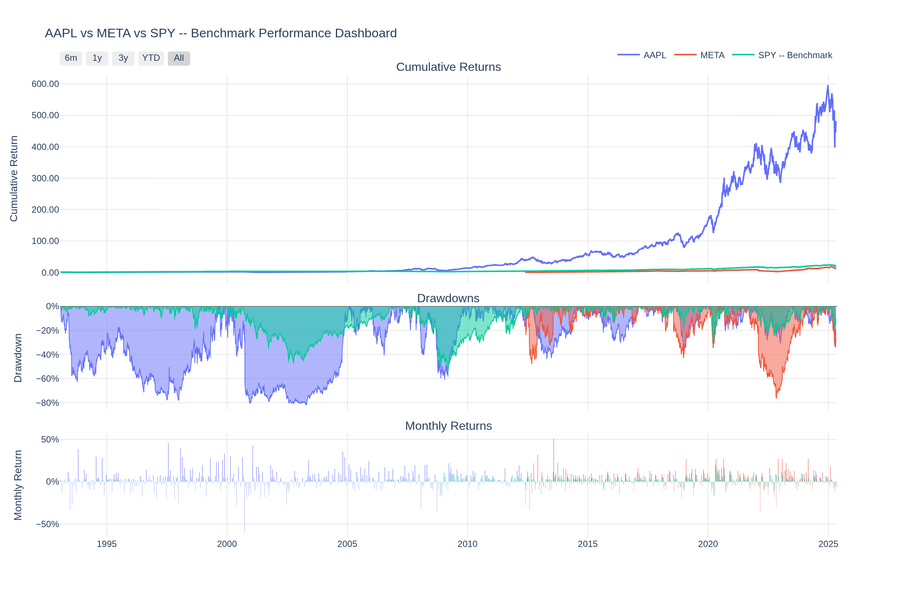
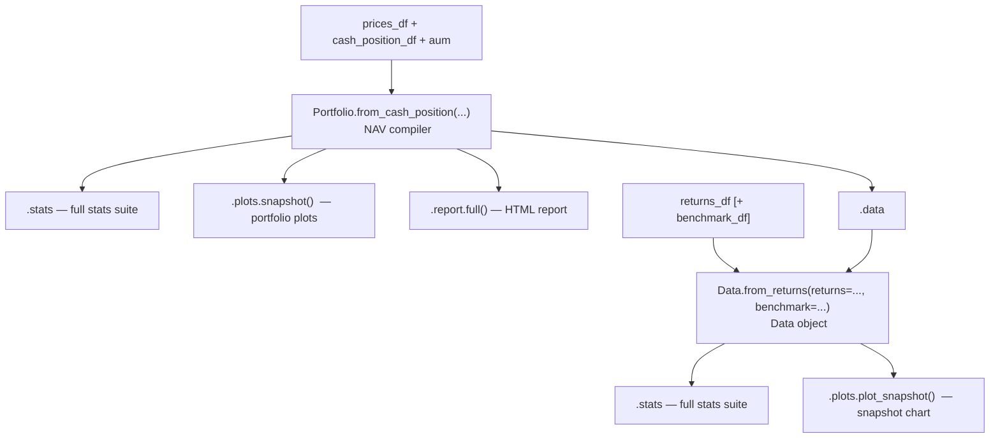

# [jQuantStats](https://tschm.github.io/jquantstats/book): Portfolio Analytics for Quants

[](https://badge.fury.io/py/jquantstats)
[](https://pypi.org/project/jquantstats/)
[](https://tschm.github.io/jquantstats/tests/html-coverage/index.html)
[](https://pepy.tech/project/jquantstats)
[](LICENSE)
[](https://www.codefactor.io/repository/github/tschm/jquantstats)
[](https://github.com/renovatebot/renovate)
[](https://github.com/jebel-quant/rhiza)

[](https://codespaces.new/tschm/jquantstats)
[](https://marimo.app/github/tschm/jquantstats/blob/main/book/marimo/notebooks/analytics_demo.py)

## 📊 Overview

**jQuantStats** is a Python library for portfolio analytics
that helps quants and portfolio managers understand their performance
through in-depth analytics and risk metrics. It provides tools
for calculating various performance metrics and visualizing
portfolio performance using interactive Plotly charts.

The library is inspired by [QuantStats](https://github.com/ranaroussi/quantstats),
but focuses on providing a clean, modern API with
enhanced visualization capabilities. Key improvements include:

- Polars-native design with zero pandas runtime dependency
- Modern interactive visualizations using Plotly
- Comprehensive test coverage with pytest
- Clean, well-documented API
- Efficient data processing with polars

## ⚡ jQuantStats vs QuantStats

| Feature | jQuantStats | QuantStats |
|---|---|---|
| **DataFrame engine** | [Polars](https://pola.rs/) (zero pandas at runtime) | pandas |
| **Visualisation** | Interactive [Plotly](https://plotly.com/python/) charts | Static matplotlib / seaborn |
| **Input format** | `polars.DataFrame` | `pandas.Series` / `pandas.DataFrame` |
| **Entry point — positions** | `Portfolio.from_cash_position(prices, cash_position, aum)` | — |
| **Entry point — returns** | `Data.from_returns(returns, benchmark)` | `qs.reports.full(returns)` |
| **HTML report** | `portfolio.report.full()` | `qs.reports.html(returns)` |
| **Snapshot chart** | `data.plots.plot_snapshot()` | `qs.plots.snapshot(returns)` |
| **Sharpe ratio** | `data.stats.sharpe()` | `qs.stats.sharpe(returns)` |
| **Sortino ratio** | `data.stats.sortino()` | `qs.stats.sortino(returns)` |
| **Max drawdown** | `data.stats.max_drawdown()` | `qs.stats.max_drawdown(returns)` |
| **Python version** | 3.11+ | 3.7+ |
| **Type annotations** | Full (`py.typed`) | Partial |
| **Test coverage** | [](https://tschm.github.io/jquantstats/tests/html-coverage/index.html) | — |

## ✨ Features

- **Performance Metrics**: Calculate key metrics like Sharpe ratio,
Sortino ratio, drawdowns, volatility, and more
- **Risk Analysis**: Analyze risk through metrics like
Value at Risk (VaR), Conditional VaR, and drawdown analysis
- **Interactive Visualizations**: Create interactive
plots for portfolio performance, drawdowns, and
return distributions
- **Benchmark Comparison**: Compare your portfolio performance against benchmarks
- **Polars-native**: Pure polars at runtime; pandas is not required and not supported as input

## 🖼️ Dashboard Preview



> *Interactive Plotly dashboard — cumulative returns, drawdowns, and monthly return heatmaps in a single view. Charts are fully interactive (zoom, pan, hover tooltips) when rendered in a browser.*

## 📦 Installation

**Using pip:**

```bash
pip install jquantstats
```

**Using conda (via conda-forge):**

```bash
conda install -c conda-forge jquantstats
```

For development:

```bash
pip install jquantstats[dev]
```

## 🚀 Quick Start

**Five lines to your first analytics result:**

```python
import polars as pl
from jquantstats import Data

returns = pl.DataFrame({
    "Date": ["2023-01-01", "2023-01-02", "2023-01-03", "2023-01-04", "2023-01-05"],
    "Strategy": [0.01, -0.03, 0.02, -0.01, 0.04],
}).with_columns(pl.col("Date").str.to_date())

benchmark = pl.DataFrame({
    "Date": ["2023-01-01", "2023-01-02", "2023-01-03", "2023-01-04", "2023-01-05"],
    "Benchmark": [0.005, -0.01, 0.008, -0.005, 0.015],
}).with_columns(pl.col("Date").str.to_date())

data = Data.from_returns(returns=returns, benchmark=benchmark)

print(data.stats.sharpe())
# {'Strategy': 4.24, 'Benchmark': 4.94}

print(data.stats.max_drawdown())
# {'Strategy': 0.03, 'Benchmark': 0.01}

fig = data.plots.plot_snapshot(title="Strategy vs Benchmark")
fig.show()  # opens an interactive Plotly chart in your browser
```

**If you have price series and position sizes** (recommended):

```python
import polars as pl
from jquantstats import Portfolio

prices = pl.DataFrame({
    "date": ["2023-01-01", "2023-01-02", "2023-01-03"],
    "Asset1": [100.0, 101.0, 99.5],
}).with_columns(pl.col("date").str.to_date())

positions = pl.DataFrame({
    "date": ["2023-01-01", "2023-01-02", "2023-01-03"],
    "Asset1": [1000.0, 1000.0, 1200.0],
}).with_columns(pl.col("date").str.to_date())

pf = Portfolio.from_cash_position(prices=prices, cash_position=positions, aum=1_000_000)

sharpe = pf.stats.sharpe()
fig = pf.plots.snapshot()  # call fig.show() to display
```

**If you already have a returns series**:

```python
import polars as pl
from jquantstats import Data

returns = pl.DataFrame({
    "Date": ["2023-01-01", "2023-01-02", "2023-01-03"],
    "Asset1": [0.01, -0.02, 0.03],
    "Asset2": [0.02, 0.01, -0.01]
}).with_columns(pl.col("Date").str.to_date())

data = Data.from_returns(returns=returns)

sharpe = data.stats.sharpe()
fig = data.plots.plot_snapshot(title="Portfolio Performance")  # call fig.show() to display
```

**Risk metrics and drawdown analysis**:

```python
import polars as pl
from jquantstats import Data

returns = pl.DataFrame({
    "Date": ["2023-01-01", "2023-01-02", "2023-01-03", "2023-01-04", "2023-01-05"],
    "Strategy": [0.01, -0.03, 0.02, -0.01, 0.04],
}).with_columns(pl.col("Date").str.to_date())

data = Data.from_returns(returns=returns)

sharpe = data.stats.sharpe()
sortino = data.stats.sortino()
max_dd = data.stats.max_drawdown()
vol = data.stats.volatility()
var = data.stats.value_at_risk()
cvar = data.stats.conditional_value_at_risk()
calmar = data.stats.calmar()
win = data.stats.win_rate()
```

**Benchmark comparison**:

```python
import polars as pl
from jquantstats import Data

returns = pl.DataFrame({
    "Date": ["2023-01-01", "2023-01-02", "2023-01-03"],
    "Strategy": [0.01, -0.02, 0.03],
}).with_columns(pl.col("Date").str.to_date())

benchmark = pl.DataFrame({
    "Date": ["2023-01-01", "2023-01-02", "2023-01-03"],
    "Benchmark": [0.005, -0.01, 0.015],
}).with_columns(pl.col("Date").str.to_date())

data = Data.from_returns(returns=returns, benchmark=benchmark)

ir = data.stats.information_ratio()
greeks = data.stats.greeks()
alpha = greeks["Strategy"]["alpha"]
beta = greeks["Strategy"]["beta"]
fig = data.plots.plot_snapshot(title="Strategy vs Benchmark")
```

**Generate a full HTML report**:

```python
import polars as pl
from jquantstats import Portfolio

prices = pl.DataFrame({
    "date": ["2023-01-01", "2023-01-02", "2023-01-03"],
    "AAPL": [150.0, 152.0, 149.5],
    "MSFT": [250.0, 253.0, 251.0],
}).with_columns(pl.col("date").str.to_date())

positions = pl.DataFrame({
    "date": ["2023-01-01", "2023-01-02", "2023-01-03"],
    "AAPL": [500.0, 500.0, 600.0],
    "MSFT": [300.0, 300.0, 300.0],
}).with_columns(pl.col("date").str.to_date())

pf = Portfolio.from_cash_position(prices=prices, cash_position=positions, aum=1_000_000)

# Save a complete HTML performance report
html = pf.report.to_html()
with open("report.html", "w") as f:
    f.write(html)
```


## 🏗️ Architecture

jQuantStats has two layered entry points:



**Entry point 1** (`Portfolio`) is for active portfolios where you have
price series and position sizes. It compiles the NAV curve and exposes
the full analytics suite.

**Entry point 2** (`Data.from_returns`) is for arbitrary return streams — e.g.
returns downloaded from a data vendor — with optional benchmark comparison.

The two APIs are layered: `portfolio.data` returns a `Data` object, so you
can always drop from a `Portfolio` into the returns-series API.

## 📚 Documentation

For detailed documentation, visit [jQuantStats Documentation](https://tschm.github.io/jquantstats/book).

## 🔧 Requirements

- Python 3.11+
- numpy
- polars
- plotly
- scipy

## 👥 Contributing

Contributions are welcome! Please feel free to submit a Pull Request.

1. Fork the repository
2. Create your feature branch (`git checkout -b feature/amazing-feature`)
3. Commit your changes (`git commit -m 'Add some amazing feature'`)
4. Push to the branch (`git push origin feature/amazing-feature`)
5. Open a Pull Request

## 📝 Citing

If you use jQuantStats in academic work or research reports, please cite it using the
[CITATIONS.bib](CITATIONS.bib) file provided in this repository:

```bibtex
@software{jquantstats,
  author    = {Schmelzer, Thomas},
  title     = {jQuantStats: Portfolio Analytics for Quants},
  url       = {https://github.com/tschm/jquantstats},
  version   = {0.1.1},
  year      = {2026},
  license   = {MIT}
}
```

## ⚖️ License

This project is licensed under the MIT
License - see the [LICENSE](LICENSE) file for details.
